# A Sample for Azure Marketplace SaaS Integration

This sample demonstrates the basic interaction of a SaaS solution with Azure
Marketplace. It does not have any SaaS functionality. It is a bare bones
approach focusing on the marketplace integration.

First, disclaimers :)

- **My intent with this sample is to demonstrate the integration concepts, and
  highlight a possible solution that may address a common scenario.**
- **This is sample quality code, and does not implement many important aspects
  for production level, such as exception handling, transient faults, proper
  logging etc. Please use it as a learning tool, and write your own code.**
- **I make frequent changes to this repo as I discover new things with the
  marketplace API. Please check back often.**
- **I tried not to take any dependencies on 3rd party libraries, and tried to
  keep it as "pure" as possible, so no SPA, no client side MVC, fancy UI, or
  other .NET packages other than JSON.NET, and SendGrid, so we can focus on the
  solution.**

You can also find a short [video published on the Azure Friday channel](https://www.youtube.com/watch?v=2Oaq5dHczMY) to see the experience and a brief explanation.

In the sections below you will find:

1. [Integrating a Software as a Solution with Azure Marketplace](#Integrating-a-Software-as-a-Solution-with-Azure-Marketplace)
2. [The scenario for the sample](#The-scenario-for-the-sample)
3. [Running the sample](#Running-the-sample)
4. [Signing Up for Your Offer](#signing-up-for-your-offer)

Let's first start with mentioning how to integrate a SaaS solution with Azure
Marketplace.

## Integrating a Software as a Solution with Azure Marketplace

Many different types of solution offers are available on Azure Marketplace for
the customers to subscribe. Those different types include options such as
virtual machines (VMs), solution templates, and containers, where a customer can
deploy the solution to their Azure subscription. Azure Marketplace also provides
the option to subscribe to a Software as a Service (SaaS) solution, which runs
in an environment other than the customer's subscription.

A SaaS solution publisher needs to integrate with the Azure Marketplace commerce
capabilities for enabling the solution to be available for purchase.

Azure Marketplace talks to a SaaS solution on two channels,

- [Landing page](###-Landing-page): The Azure Marketplace sends the subscriber
  to this page maintained by the publisher to capture the details for
  provisioning the solution for the subscriber. The subscriber is on this page
  for the activating the subscription, or modifying it.
- [Webhook](###-Webhook-endpoint): This is an endpoint where the Azure
  Marketplace notifies the solution for the events such as subscription cancel
  and update, or suspend request for the subscription, should the customer's
  payment method becomes unusable.

The SaaS solution in turn uses the REST API exposed on the Azure Marketplace
side to perform corresponding operations. Those can be activating, cancelling,
updating a subscription.

To summarize, we can talk about three interaction areas between the Azure
Marketplace and the SaaS solution,

1. Landing page
2. Webhook endpoint
3. Calls on the Azure Marketplace REST API

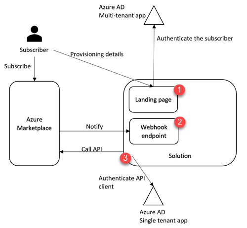

### Landing page

On this page, the subscriber provides additional details to the publisher so the
publisher can provision required resources for the subscriber new subscription.

You, as the publisher can collect additional information here for customizing
the provisioning steps when onboarding a customer.

**Important:** the subscriber can access this page after subscribing to an offer
to make changes to his/her subscription, such as upgrading, downgrading, or any
other changes to the subscription from Azure portal.

A publisher provides the URL for this page when registering the offer for Azure
Marketplace.

The publisher can collect other information from the subscriber to onboard the
customer, and provision additional resources. The publisher's solution can also
ask for consent to access other resources owned by the customer, and protected
by AAD, such as Microsoft Graph API, Azure Management API etc.

As noted above, the subscriber can access the landing page after subscribing to
the offer to make changes to the subscription.

#### Multi-Tenant Azure AD Requirement

This page should authenticate a subscriber through Azure Active Directory (AAD)
using the [OpenID
Connect](https://docs.microsoft.com/en-us/azure/active-directory/develop/v2-protocols-oidc)
flow. The publisher should register a multi-tenant AAD application for the
landing page.

### Webhook endpoint

This is the second URL the publisher provides when registering the offer. The
Azure Marketplace calls this endpoint to notify the solution for the events
happening on the marketplace side. Those events can be the cancellation, and
update of the subscription through Azure Marketplace, or suspending it, because
of the unavailability of customer's payment method.

This endpoint is not protected. The implementation should call the marketplace
REST API to ensure the validity of the event.

### Marketplace REST API interactions

The Fulfillment API is documented
[here](https://docs.microsoft.com/en-us/azure/marketplace/partner-center-portal/pc-saas-fulfillment-api-v2)
for subscription integration, and the usage based metering API documentation is
[here](https://docs.microsoft.com/en-us/azure/marketplace/partner-center-portal/marketplace-metering-service-apis).

#### Single-Tenant Azure AD Requirement

The publisher should register an AAD application and provide the AppID
(ClientId) and the tenant ID (AAD directory where the app is registered) during
registering the offer for the marketplace.

The solution is put on a whitelist so it can call the marketplace REST API with
those details. A client must use [service-to-service access token
request](https://docs.microsoft.com/en-us/azure/active-directory/develop/v1-oauth2-client-creds-grant-flow#service-to-service-access-token-request)
of the client credential workflow, and with the v1 Azure AD endpoint. Use the Marketplace Fulfillment API V2.0's resource ID,62d94f6c-d599-489b-a797-3e10e42fbe22 for the resource parameter

There needs to be a **one-to-one match between the publisher account and the application**. If a publisher has multiple SaaS offers under the same publisher account, all of those offers need to use the same TenantId/AppId.

If you have multiple publisher accounts for various reasons, please do not use the TenantId/AppId for offers under different publisher accounts.

Please note the different requirements for the Azure AD interaction for the
landing page and calling the APIs. I recommend two separate AAD applications,
one for the landing page, and one for the API interactions, so you can have
proper separation of concerns when authenticating against Azure AD.

This way, you can ask the subscriber for consent to access his/her Graph API,
Azure Management API, or any other API that is protected by Azure AD on the
landing page, and separate the security for accessing the marketplace API from
this interaction. Good practice...

### Activating a subscription

Let's go through the steps of activating a subscription to an offer.


1. Customer subscribes to an offer on Azure Marketplace
2. Commerce engine generates marketplace token for the landing page. This is an
   opaque token (unlike a JSON Web Token, JWT that is returned when
   authenticating against Azure AD) and does not contain any information. It is
   just an index to the subscription and used by the resolve API to retrieve
   the details of a subscription. This token is available when the user clicks
   the "Configure Account" for an inactive subscription, or "Manage Account"
   for an active subscription
3. Customer clicks on the "Configure Account" (new and not activated
   subscription) or "Managed Account" (activated subscription) and accesses the
   landing page
4. Landing page asks the user to logon using Azure AD [OpenID
   Connect](https://docs.microsoft.com/en-us/azure/active-directory/develop/v2-protocols-oidc)
   flow
5. Azure AD returns the id_token. There needs to be additional steps for
   validating the id_token. Just receiving an id_token is not enough for
   authentication. Also, the solution may need to ask for authorization to
   access other resources on behalf of the user. We are not covering them for
   brevity and ask you to refer to the related Azure AD documentation
6. Solution asks for an access token using the use [service-to-service access
   token
   request](https://docs.microsoft.com/en-us/azure/active-directory/develop/v1-oauth2-client-creds-grant-flow#service-to-service-access-token-request)
   of the client credential workflow to be able to call the API
7. Azure AD returns the access token
8. Solution prepends "Bearer " (notice the space) to the access token, and adds
   it to the "Authorization" header of the outgoing request. We are using the
   marketplace token previously received on the landing page to get the details
   of the subscription using the "resolve" API
9. The subscription details is returned
10. Further API calls are made, again using the access token obtained from the
    Azure AD, in this case to activate the subscription

## The scenario for the sample

This sample can be a good starting point if the solution does not have
requirements for providing native experience for cancelling and updating a
subscription by a customer.

It exposes a landing page that can be customized for branding. It provides a
webhook endpoint for processing the incoming notifications from the Azure
Marketplace. The rest of the integration is done via emails.

The landing page can also used for adding new fields for getting more
information from the subscriber, for example what is the favored region.When a
subscriber provides the details on the landing page, the solution generates an
email to the configured operations contact. The operations team then provisions
the required resources and onbards the customer using their internal processes
then comes back to the generated email and clicks on the link in the email to
activate the subscription.

Please see my overview for the integration points in section "Integrating a
Software as a Solution with Azure Marketplace".

- [Landing
  page](https://github.com/Ercenk/ContosoAMPBasic/blob/master/src/Dashboard/Controllers/LandingPageController.cs#L27)

- [Webhook
  endpoint](https://github.com/Ercenk/ContosoAMPBasic/blob/master/src/Dashboard/Controllers/WebHookController.cs)

- [Calling the
  API](https://github.com/Ercenk/ContosoAMPBasic/blob/master/src/Dashboard/Controllers/LandingPageController.cs#L19)

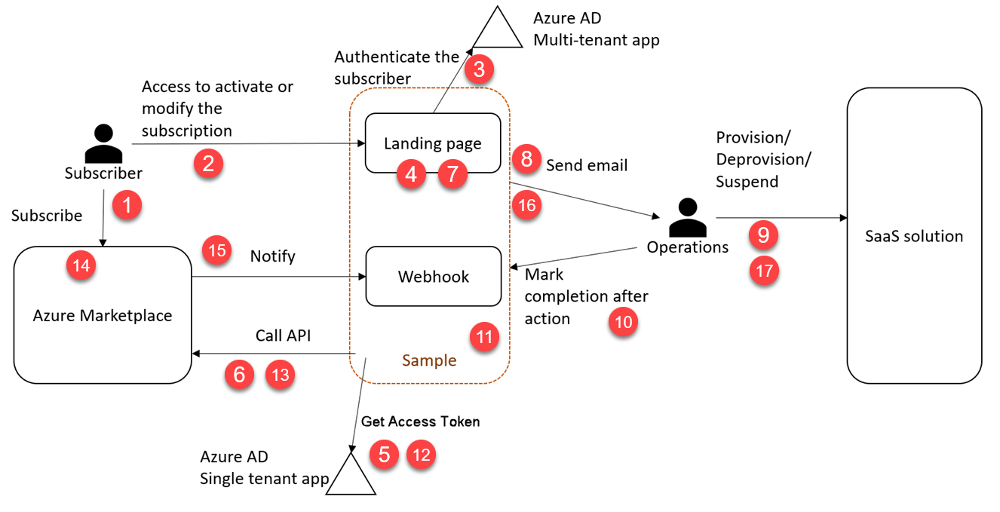

Remember, this scenario is useful when there is a human element in the mix, for situations such as

- A script needs to be run manually for provisioning resources for a new customer, as part of the onboarding process
- A team needs to qualify the purchase of the customer, for reasons like ITAR certification etc.

Let's go through the scenario.

1. The prospective customer is on Azure Portal, and going through the Azure Marketplace in-product experience on the portal. Finds the solution and subscribes to it, after deciding on the plan. A placeholder resource is deployed on the customer's (subscriber's) Azure subscription for the new subscription to the offer. Please notice the overloaded use of the "subscription", there are two subscriptions at this moment, the customer's Azure subscription and the subscription to the SaaS offer. I will use **subscription** only when I refer to the subscription to the offer from now on.

1. Subscriber clicks on the **Configure Account** button on the new subscription, and gets transferred to the landing page.

1. Landing page uses Azure Active Directory (with OpenID Connect flow) to log the user on

1. Landing page uses the SDK to resolve the subscription to get the details, using the marketplace token on the landing page URL token parameter

1. SDK gets an access token from Azure Active Directory (AAD)

1. SDK calls **resolve** operation on the Fulfillment API, using the access token as a bearer token

1. Subscriber fills in the other details on the landing page that will help the operations team to kick of the provisioning process. The landing page asks for a deployment region, as well as the email of the business unit contact.The solution may be using different data retention policies based on the region (GDPR comes to mind for Europe), or the solution may be depending on a completely different identity provider (IP), such as in-house developed, and may be sending an email to the business unit owner, asking him/her to add the other end users to the solution's account management system. Please keep in mind that the person subscribing, that is the purchaser (having access to the Azure subscription) can be different than the end user(s) of the solution.

1. Subscriber completes the process by submitting the form on the landing page. This sends an email to the operations team email address (configured in the settings)

1. Operations team takes the appropriate steps (qualifying, provisioning resources etc.)

1. Once complete, operation team clicks on the activate link in the email

1. The sample uses the SDK to activate the subscription

1. SDK gets an access token from Azure Active Directory (AAD)

1. SDK calls the **activate** operation on the Fulfillment API

1. The subscriber may eventually unsubscribe from the subscription by deleting it, or may stop fulfilling his/her monetary commitment to Microsoft

1. The commerce engine sends a notification on the webhook at this time, for letting the publisher know about the situation

1. The sample sends an email to the operations team, notifying the team about the status

1. The operations team may de-provision the customer

## Running the sample

The top-level actions are:

- [A Sample for Azure Marketplace SaaS Integration](#a-sample-for-azure-marketplace-saas-integration)
  - [Integrating a Software as a Solution with Azure Marketplace](#integrating-a-software-as-a-solution-with-azure-marketplace)
    - [Landing page](#landing-page)
      - [Multi-Tenant Azure AD Requirement](#multi-tenant-azure-ad-requirement)
    - [Webhook endpoint](#webhook-endpoint)
    - [Marketplace REST API interactions](#marketplace-rest-api-interactions)
      - [Single-Tenant Azure AD Requirement](#single-tenant-azure-ad-requirement)
    - [Activating a subscription](#activating-a-subscription)
  - [The scenario for the sample](#the-scenario-for-the-sample)
  - [Running the sample](#running-the-sample)
    - [Creating a web application on Azure App Service and deploy the sample](#creating-a-web-application-on-azure-app-service-and-deploy-the-sample)
    - [Registering Azure Active Directory applications](#registering-azure-active-directory-applications)
      - [Creating a new directory](#creating-a-new-directory)
      - [Registering the apps](#registering-the-apps)
    - [Create an offer on Commercial Marketplace Portal in Partner center](#create-an-offer-on-commercial-marketplace-portal-in-partner-center)
    - [Creating and configuring a SendGrid account](#creating-and-configuring-a-sendgrid-account)
    - [Creating a storage account](#creating-a-storage-account)
    - [Change the configuration settings](#change-the-configuration-settings)
  - [Signing Up for Your Offer](#signing-up-for-your-offer)
  - [Notes](#notes)
    - [Secrets](#secrets)
      - [An experimental API client, and webhook processor helper](#an-experimental-api-client-and-webhook-processor-helper)

### Creating a web application on Azure App Service and deploy the sample

I am assuming you have already cloned the code in this repo. Open the solution
in Visual Studio, and follow the steps for deploying the solution starting from
this
[step](https://docs.microsoft.com/en-us/azure/app-service/app-service-web-get-started-dotnet#publish-your-web-app).

Following is how my Visual Studio Publish profile looks like:

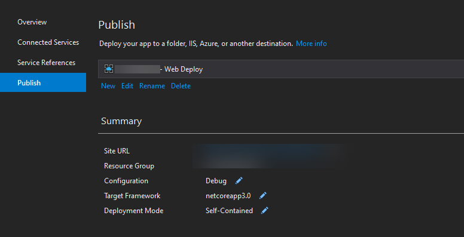

### Registering Azure Active Directory applications

I usually maintain a separate Azure Active Directory tenant (directory) for my
application registrations. If you want to register the apps on your default
directory, you can skip the following steps and go directly to registering
applications.

#### Creating a new directory

To create one,

1.  Login to Azure [portal](https://portal.azure.com)

2.  Click "Create a resource", and type in "azure active directory" in the
    search box, and select

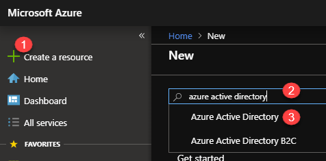

```
Then fill in the details as you see fit after clicking the "create" button
```

1.  Switch to the new directory.


1.  Select the new directory, if it does not show under "Favorites" check "All
    directories"


Once you switch to the new directory (or if you have not created a new one, and
decided to use the existing one instead), select the Active Directory service (1
on the image below). If you do not see it, find it using "All services" (2 on
the image below).


Click on "App registrations", and select "New registration". You will need to
create two apps.

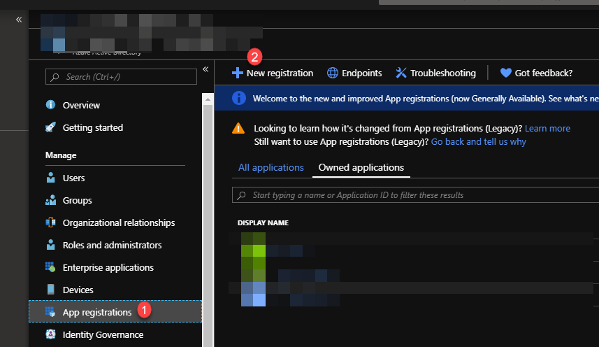

#### Registering the apps

As I mention in the landing page and webhook sections above, I recommend
registering two applications:

1.  **For the landing page,** the Azure Marketplace SaaS offers are required to
    have a landing page, authenticating through Azure Active Directory. Register
    it as described in the
    [documentation](https://docs.microsoft.com/en-us/azure/active-directory/develop/quickstart-v2-aspnet-core-webapp#option-2-register-and-manually-configure-your-application-and-code-sample).
    **Make sure you register a multi-tenant application**, you can find the
    differences in the
    [documentation](https://docs.microsoft.com/en-us/azure/active-directory/develop/single-and-multi-tenant-apps).
    Select the "ID tokens" on the "Authentication" page. Also add two Redirect
    URLs, he base URL of the web app, and another web app URL with /signin-oidc
    added.

2.  **To authenticate Azure Marketplace Fulfillment APIs,** you can register a
    **single tenant application**.

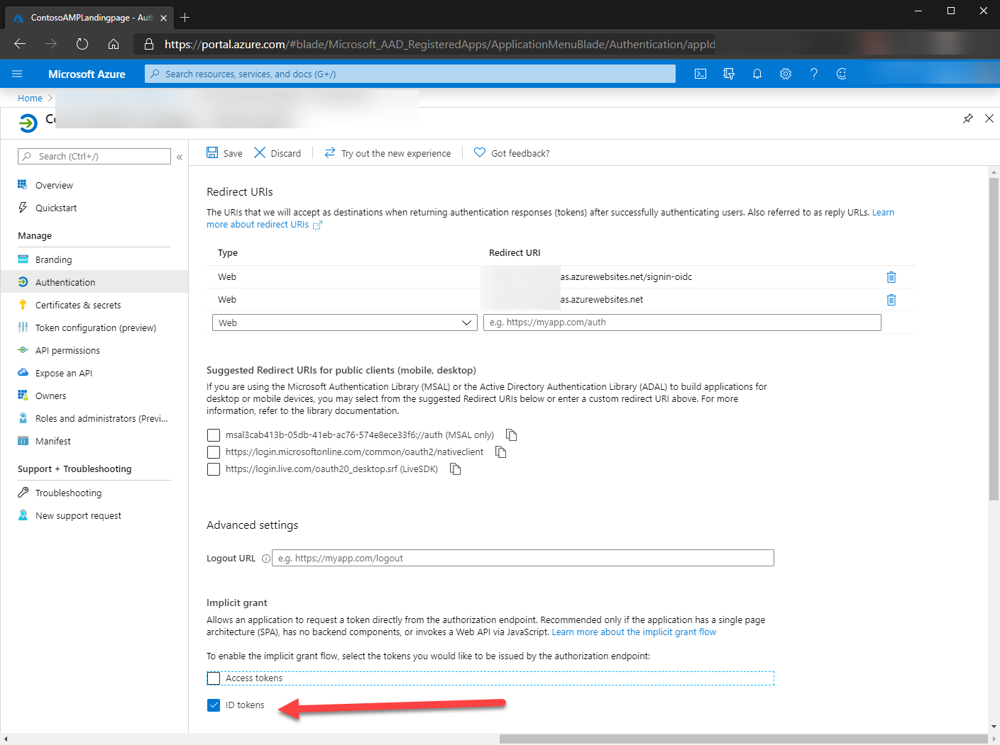

### Create an offer on Commercial Marketplace Portal in Partner center

Base requirement is to have a SaaS offer set up through the Partner Center.
Please see the checklist for creating the offer
[here](https://docs.microsoft.com/en-us/azure/marketplace/partner-center-portal/offer-creation-checklist).

You will need to provide the application ID (also referred to as the "client
ID") and the tenant ID on the ["Technical Configuration
page"](https://docs.microsoft.com/en-us/azure/marketplace/partner-center-portal/offer-creation-checklist#technical-configuration-page)
on the Partner portal while registering your offer. Copy the tenant ID and the
client ID of the single tenant application you created (the second app) and set
them on the technical configuration page.

Copy the base URL of the web application, and set the value of the landing page,
by adding `/landingpage` to the end, and set the webhook URL by adding `/webhook` to
the end of the base URL of the web application.

Also create test plans, with \$0 cost, so you do not charge yourself when testing. Please remember to add a list of users as authorized preview users on the "Preview" tab.

[Create a SaaS Offer](https://docs.microsoft.com/en-us/azure/marketplace/partner-center-portal/create-new-saas-offer)

### Creating and configuring a SendGrid account

Follow the steps in the
[tutorial](https://docs.microsoft.com/en-us/azure/sendgrid-dotnet-how-to-send-email),
and grab an API Key. Set the value of the ApiKey in the configuration section,
"Dashboard:Mail", either using the user-secrets method or in the appconfig.json
file.

### Creating a storage account

Create an Azure Storage account following the steps [here](https://docs.microsoft.com/en-us/azure/storage/common/storage-account-create?tabs=azure-portal). The solution uses the
storage account to keep references to the operations returned by actions done on
the fulfillment API.

### Change the configuration settings

You will need to modify the settings with the values for the services you have
created above.

You will need to replace the values marked as "CHANGE" or "SET USING dotnet
user-secrets" in the appsettings.json file.

For those values marked with "SET USING dotnet user-secrets" you can either plug
the values in the appsettings.json file, or use the dotnet user-secrets command.
Please see the section "Secrets" below for the details if you want to use user
secrets method.

| Setting                                           | Change/Keep | Notes                                                                                                                                                                                                         |
| ------------------------------------------------- | ----------- | ------------------------------------------------------------------------------------------------------------------------------------------------------------------------------------------------------------- |
| AzureAd:Instance                                  | Keep        | The landing page is using a multi-tenant app. Keep the instance value                                                                                                                                         |
| AzureAd:Domain                                    | Change      | You can find this value on the "Overview" page of the Active Directory you have registered your applications in. If you are not using a custom domain, it is in the format of \<tenant name\>.onmicrosoft.com |
| AzureAd:TenantId                                  | Keep        | Common authentication endpoint, since this is a multi-tenant app                                                                                                                                              |
| AzureAd:ClientId                                  | Change      | Copy the clientId of the multi-tenant app from its "Overview" page                                                                                                                                            |
| AzureAd:CallbackPath                              | Keep        | Default oidc sign in path                                                                                                                                                                                     |
| AzureAd:SignedOutCallbackPath                     | Keep        | Default sign out path                                                                                                                                                                                         |
| FulfillmentClient:AzureActiveDirectory:ClientId   | Change      | Copy the clientId of the single-tenant app from its "Overview" page. This AD app is for calling the Fulfillment API                                                                                           |
| FulfillmentClient:AzureActiveDirectory:TenantId   | Change      | Copy the tenantId of the single-tenant app from its "Overview" page.                                                                                                                                          |
| FulfillmentClient:AzureActiveDirectory:AppKey     | Change      | Go to the "Certificates & secrets" page of the single-tenant app you have registered, create a new client secret, and copy the value to the clipboard, then set the value for this setting.                   |
| FulfillmentClient:FulfillmentService:BaseUri      | Keep        | The Azure Marketplace API endpoint.                                                                                                                                                                           |
| FulfillmentClient:FulfillmentService:ApiVersion   | Change      | Change if you want to hit the production or mock API. 2018-08-31 is for production, 2018-09-15 is for mock API                                                                                                |
| FulfillmentClient:OperationsStoreConnectionString | Change      | Copy the connection string of the storage account you have created in the previous step. Please see [SDK documentation for details](https://github.com/Ercenk/AzureMarketplaceSaaSApiClient#operations-store) |
| Dashboard:Mail:OperationsTeamEmail                | Change      | The sample sends emails to this address.                                                                                                                                                                      |
| Dashboard:Mail:FromEmail                          | Change      | Sendgrid requires a "from" email address when sending emails.                                                                                                                                                 |
| Dashboard:Mail:ApiKey                             | Change      | Sendgrid API key.                                                                                                                                                                                             |
| Dashboard:DashboardAdmin                          | Change      | Change it to the email address you are logging on to the dashboard. Only the users with the domain name of this email is authorized to use the dashboard to display the subscriptions.                        |
| Dashboard:ShowUnsubscribed                        | Change      | Change true or false, depending on if you want to see the subscriptions that are not active.                                                                                                                  |

## Signing Up for Your Offer

Customer searches for the offer on Azure Portal

1. Go to Azure Portal and add a resource

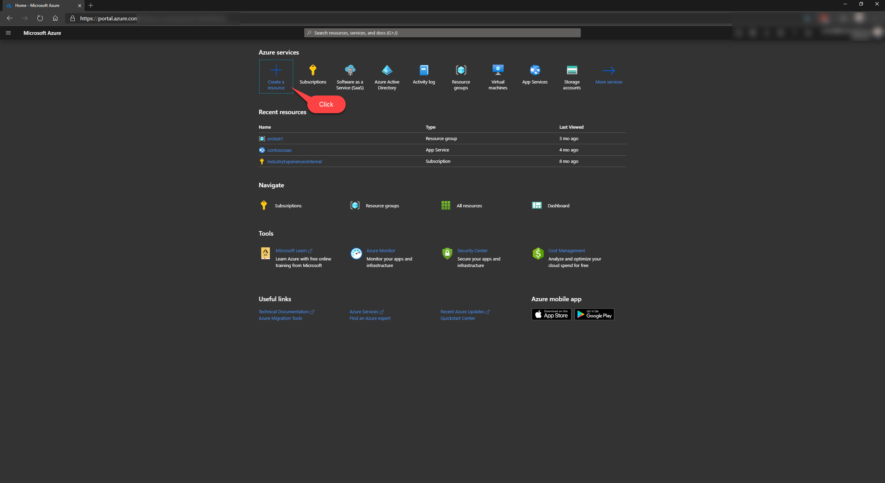

2. Find the search text box

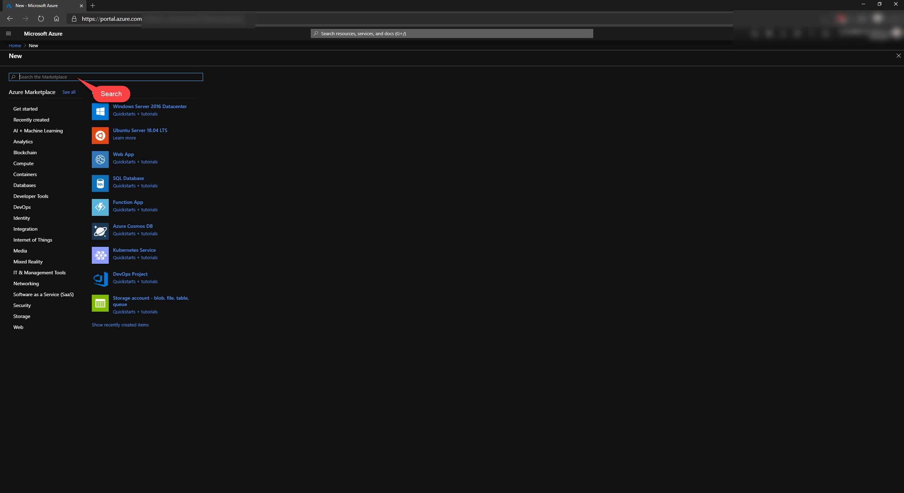

3. Type in your offer name

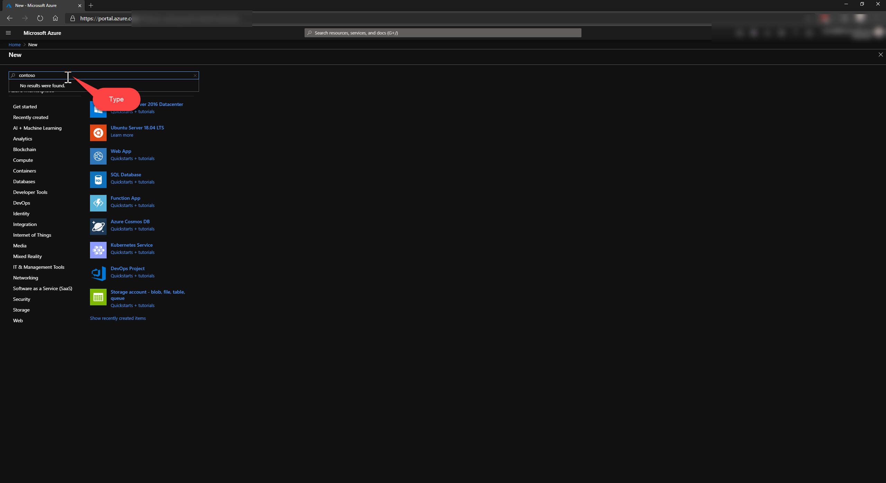

4. Select the plan

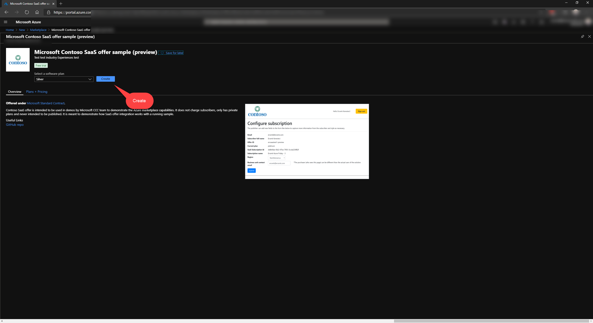

5. Subscribe

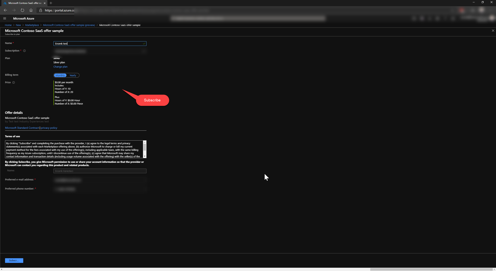

6. Find the subscription after the deployment is complete, and go the subscription


7. Subscription details, notice it is not active yet


8. Landing page


9. Purchaser submits the form, and Contoso ops team receives an email


10. Contoso team takes the appropriate action to qualify and onboard the customer

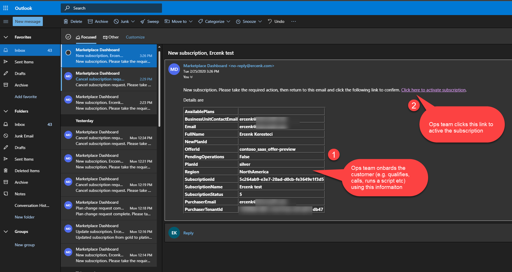

## Notes

### Secrets

Secrets such as API keys are managed through "dotnet user-secrets" command. For
example, to set the value for "FulfillmentClient:AzureActiveDirectory:AppKey"
use the following command:

```shell
dotnet user-secrets set "FulfillmentClient:AzureActiveDirectory:AppKey" "secret here"
```

Please see the user secrets
[documentation](https://docs.microsoft.com/en-us/aspnet/core/security/app-secrets?view=aspnetcore-2.2&tabs=windows)
for more details.

Alternatively, if you are not going to publish your code, and will just keep the
code on your computer, you can also modify the appsettings.json to add your
secrets.

#### An experimental API client, and webhook processor helper

I have an experimental API client I posted on a different repo that implements
the API interactions as well as encapsulates the webhook interaction. Please
take a look at this
[repo](https://github.com/Ercenk/AzureMarketplaceSaaSApiClient).
